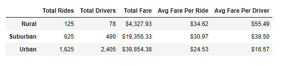
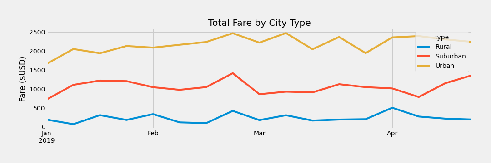

# PyBer Analysis
An exercise in PyBer, a ride-sharing app company valued at $2.3 billion. The project analyzes all the rideshare data from January to early May of 2019 with compelling visualizations.

## Overview
The purpose of the analysis is to look at PyBer data and create a comprehensive summary of the data, while providing 3 business recommendations to address any dispairities among city types (the types being Urban, Suburban, and Rural).

### Resources
Data input files (located in the "Resources" folder):
- city_data.csv 
- ride_data.csv

The technology used here were the following:

- Python 3.7.6
- Jupyter Notebooks

## Results
After compiling and organizing the data, we created a dataframe explaining our process:

### Differences in Ride-Share Data
Through our analysis, we came up with the following dataframe for our summary of key statistics:

  

In our analysis, we found that total rides were in favor of urban rides, with 1625 rides in Urban, and 625 Suburban and 125 Rural. This seems to align well with the fact that more rides are needed in places where both a) less of the target market has access to vehicles, and b) densely-populated areas require more rides for more people. For these same reasons, the total drivers in the area replicate similar results, with Urban cities having 2,405 drivers, while suburban had 490 and rural had 78. These results show that the supply of drivers skews in a similar manner to the demand of rides.   However, while Urban drivers are over almost 5.0x greater than suburban drivers, the total fares in urban cities are only a little more than 2.0x greater than in suburban areas. Looking t the average fare per ride, urban cities, at $24.53 per ride, don't perform as highly as suburban (at $30.97) and rural areas (at $34.62). The reason behind this makes sense, however - rides in rural areas are typically longer in both duration and distance, resulting in higher fares.     However, what is alarming is the average fare per driver. When you look at the average fares per driver, urban drivers make an average fare of $16.57, which lacks in comparison to suburban drivers who make $39.50 in fare per driver, and rural who makes $55.49 in fares per driver. This is indicative of an overflux of drivers in urban areas, as drivers in rural areas make more in total than in urban areas. Overcompetition of drivers and undervaluations of fares in rural areas may be a result of this. Dependent on the level of service and availability of vehicles that PyBer would like to offer, there may be opportunity to move assets around here.    

### Fares Vary by Both Month and City Type

Based on the graph of 2019 data from Jan-Mar above, there are some obvious spikes and dips in the data. For one, all city types spiked in fares in the last week of February. This may be indicative of February break, or President's Day weekend, which is a typical holiday where people travel more. A similar (but slight) trend is in the second week of March, which is where St. Patrick's Day falls under. Another thing to note is the increase in the suburban fares, as they seemed to have increased greatly over the most recent few weeks.

## Conclusions
Based on the above analysis, we can provide the following recommendations to the CEO:
1. <b>Reallocation of Assets:</b> Based on the influx of drivers in urban areas, there is a need to increase supply in other areas to bring down prices in less populous areas. To increase the availability of drivers in less densely-populated areas, we would recommend to expand training and provide incentives to drivers to locate closer to more sparsely populated areas. Incentives include higher bonuses and more weight on distance when calculating a driver's cut of the fare, which would naturally locate them further away from cities. However, this is dependent on the company's key strategies. If focusing on availability of drivers in urban areas is a core value, then this recommendation should not be followed.
2. <b>Holiday Prioritization</b>: To maximize fares, hoildays should be prioritized. As we saw in our monthly graph from 2019, traffic seems to spike during most holiday weeks (February break, St. Patrick's Day, April vacation, etc). To make these a priority, making work more rewarding (i.e. higher bonuses) for drivers on these weeks should be implemented. 
3. <b>Look Suburban</b>: Suburban cities seem to be gaining higher traction, which could be useful for management to set up recruiting locations nearby these areas, in order to fill demand by supplying more drivers in these areas. 
